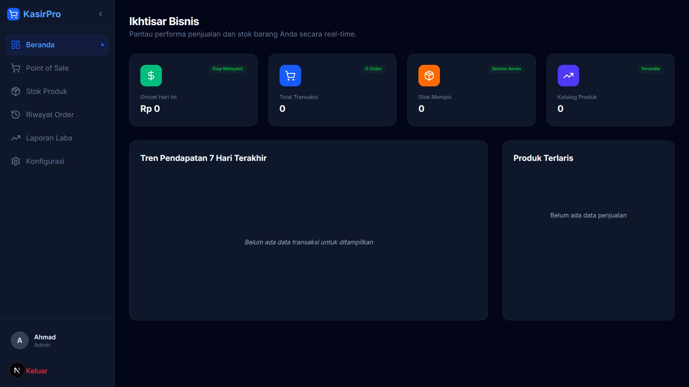

# 🚀 KasirPro Modern

**Experience the future of retail management.** KasirPro Modern is a high-performance, cloud-based Point of Sale (POS) solution meticulously engineered for SMEs and modern retailers. We bridge the gap between complex enterprise software and manual tracking by providing a seamless, data-driven experience that empowers business owners to scale with confidence.

---

## 🔗 Live Operations
Experience the system live in production:
👉 **[Live Demo](https://kasir-modern.anduril.web.id/)**

### 🔑 Demo Credentials
Access the full administrative suite using:
*   **Email**: `admin@kasirpro.id`
*   **Password**: `111111`

---

## 📸 Product Preview


---

## 🏗️ Project Overview

In today's fast-paced digital economy, business owners struggle with fragmented data, manual inventory tracking, and slow checkout processes. **KasirPro Modern** solves these challenges by centralizing your operations into a single, cohesive digital hub. From lightning-fast transaction processing to real-time profit analytics, we provide the tools you need to optimize efficiency and drive growth.

---

## ✨ Key Features

*   ✅ **Ultra-Fast POS Interface**: Designed for high-cadence retail environments.
*   ✅ **Real-Time Inventory System**: Automated stock adjustments and low-stock alerts.
*   ✅ **Insightful Analytics**: Dynamic dashboards visualizing revenue trends and top performers.
*   ✅ **Comprehensive Reporting**: Detailed profit/loss analysis and transaction history.
*   ✅ **Modern & Responsive UI**: Fully optimized for desktops, tablets, and kiosks.
*   ✅ **Secure Authentication**: Built-in security layers to protect sensitive business data.

---

## 👨‍💻 Tech Stack

*   **Framework**: [Next.js](https://nextjs.org/) (App Router)
*   **Language**: [TypeScript](https://www.typescriptlang.org/) for type safety
*   **Styling**: [Tailwind CSS](https://tailwindcss.com/) for fluid design
*   **Backend & DB**: [Supabase](https://supabase.com/) (PostgreSQL + Real-time)
*   **State Management**: [Zustand](https://github.com/pmndrs/zustand)

---

## 🔌 Supabase Integration Guide

To get the backend fully operational, you'll need to set up a Supabase project and execute the following SQL in your SQL Editor:

### 1. Database Schema
```sql
-- Core Table: User Profiles
CREATE TABLE profiles (
  id UUID REFERENCES auth.users ON DELETE CASCADE PRIMARY KEY,
  name TEXT,
  role TEXT DEFAULT 'CASHIER' -- 'ADMIN' or 'CASHIER'
);

-- Core Table: Product Categories
CREATE TABLE categories (
  id BIGINT GENERATED BY DEFAULT AS IDENTITY PRIMARY KEY,
  name TEXT NOT NULL,
  slug TEXT,
  created_at TIMESTAMPTZ DEFAULT NOW()
);

-- Core Table: Products
CREATE TABLE products (
  id BIGINT GENERATED BY DEFAULT AS IDENTITY PRIMARY KEY,
  name TEXT NOT NULL,
  description TEXT,
  price NUMERIC NOT NULL,
  stock INT DEFAULT 0,
  image TEXT,
  barcode TEXT,
  category_id BIGINT REFERENCES categories(id),
  created_at TIMESTAMPTZ DEFAULT NOW()
);

-- Core Table: Transactions
CREATE TABLE transactions (
  id UUID DEFAULT gen_random_uuid() PRIMARY KEY,
  subtotal NUMERIC NOT NULL,
  tax NUMERIC NOT NULL,
  total NUMERIC NOT NULL,
  payment_method TEXT NOT NULL,
  amount_paid NUMERIC NOT NULL,
  change NUMERIC NOT NULL,
  cashier_id UUID REFERENCES auth.users(id),
  created_at TIMESTAMPTZ DEFAULT NOW()
);

-- Core Table: Transaction Items
CREATE TABLE transaction_items (
  id BIGINT GENERATED BY DEFAULT AS IDENTITY PRIMARY KEY,
  transaction_id UUID REFERENCES transactions(id) ON DELETE CASCADE,
  product_id BIGINT REFERENCES products(id),
  name TEXT NOT NULL,
  price NUMERIC NOT NULL,
  quantity INT NOT NULL
);
-- Core Table: Stock Mutations
CREATE TABLE stock_mutations (
  id UUID DEFAULT gen_random_uuid() PRIMARY KEY,
  product_id BIGINT REFERENCES products(id) ON DELETE CASCADE,
  product_name TEXT NOT NULL,
  type TEXT NOT NULL, -- 'IN', 'OUT', or 'RETURN'
  quantity INT NOT NULL,
  note TEXT,
  user_id UUID REFERENCES auth.users(id),
  created_at TIMESTAMPTZ DEFAULT NOW()
);
```

### 2. Enable Real-time
Enable **Realtime** for `products`, `transactions`, and `stock_mutations` tables in `Database -> Replication`.

---

## 🛠️ Installation Guide

1.  **Clone the Repository**
    ```bash
    git clone https://github.com/andurila19-lgtm/Kasir_Modern.git
    cd Kasir_Modern
    ```

2.  **Environment Setup**
    Create `.env.local`:
    ```env
    NEXT_PUBLIC_SUPABASE_URL=your_url
    NEXT_PUBLIC_SUPABASE_ANON_KEY=your_key
    ```

3.  **Install & Run**
    ```bash
    npm install
    npm run dev
    ```

---

## 🛡️ Admin & Demo Mode
Sensitive administrative sections are hidden for live demos. To enable:
1.  Open `src/app/(dashboard)/settings/page.tsx`.
2.  Set `const showAdminTools = true;`.

---
*Built with passion by **Amad**.*
